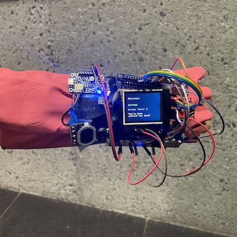
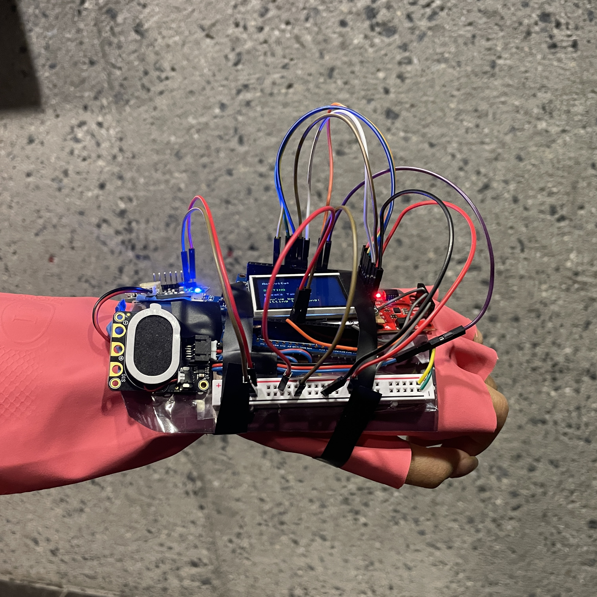
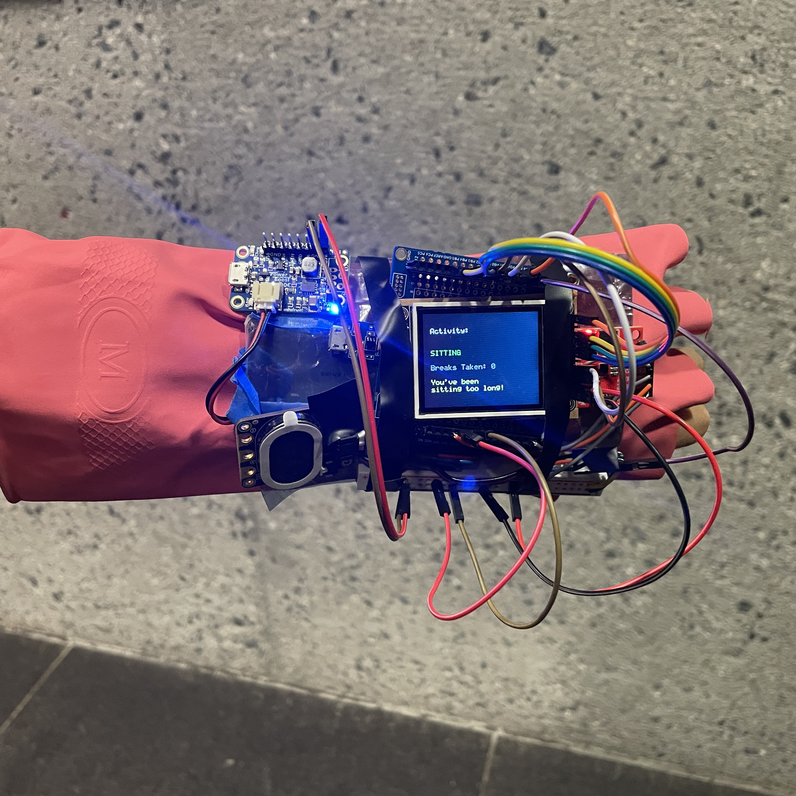
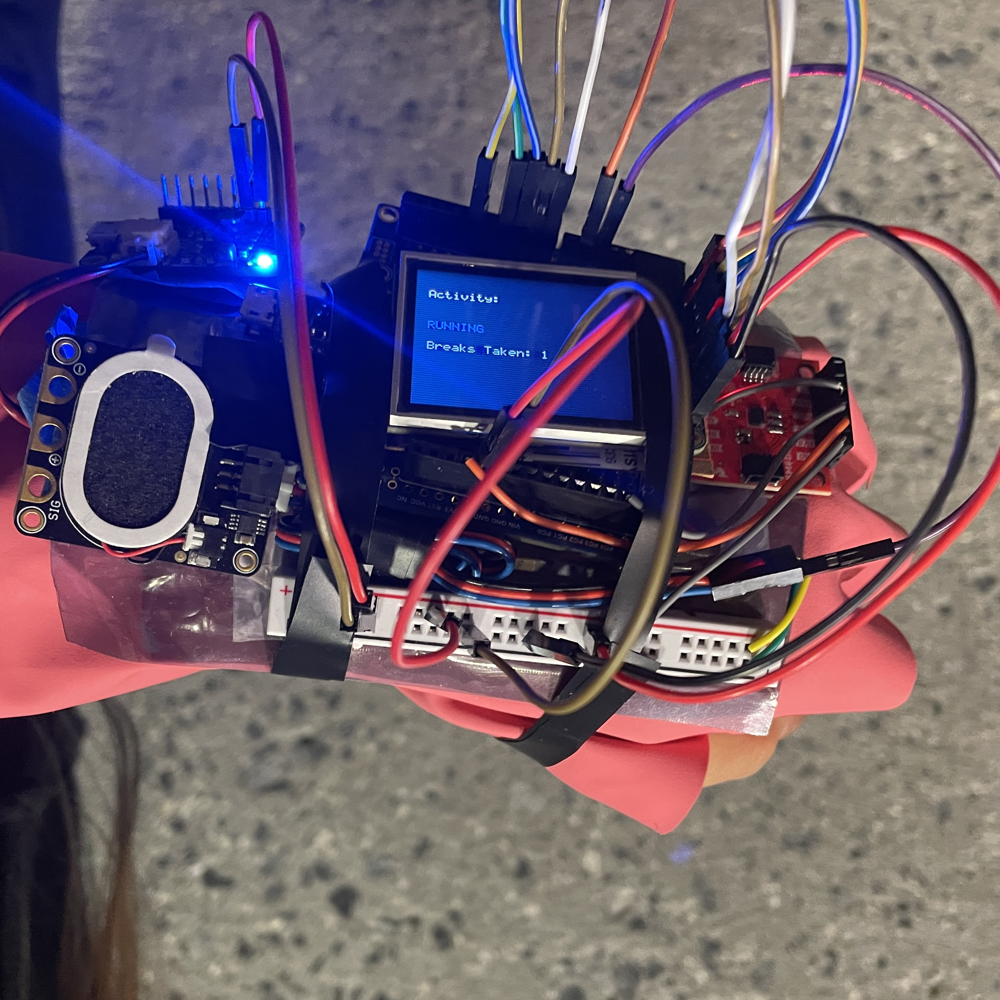
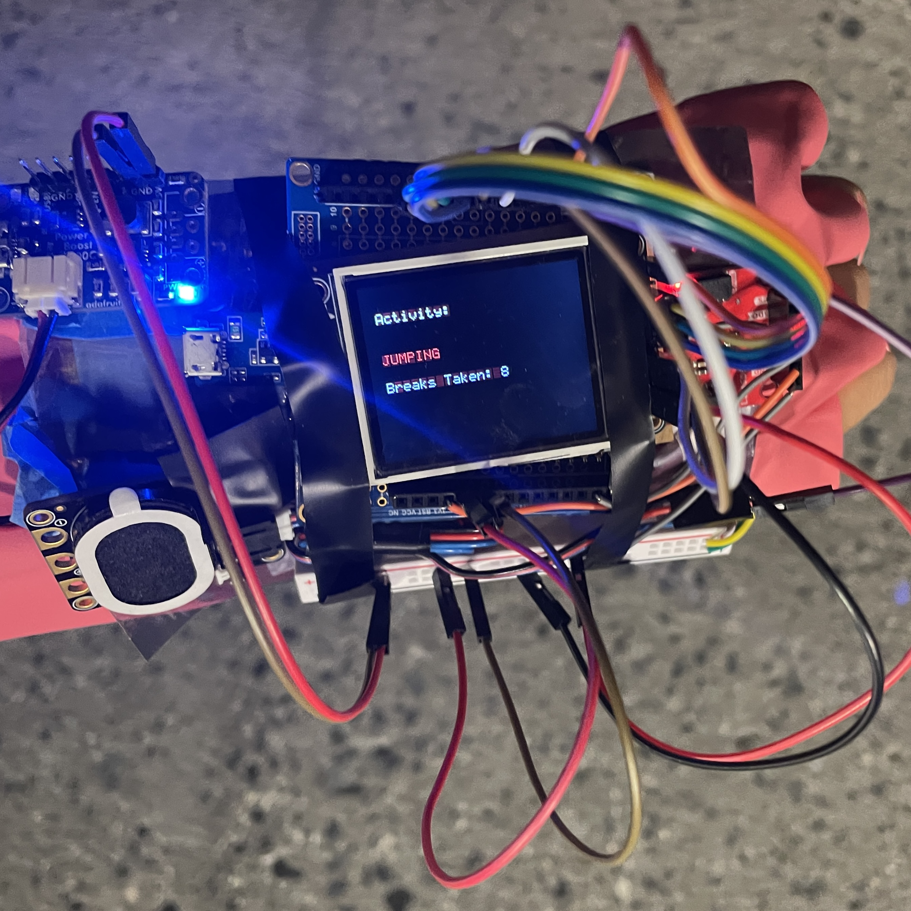
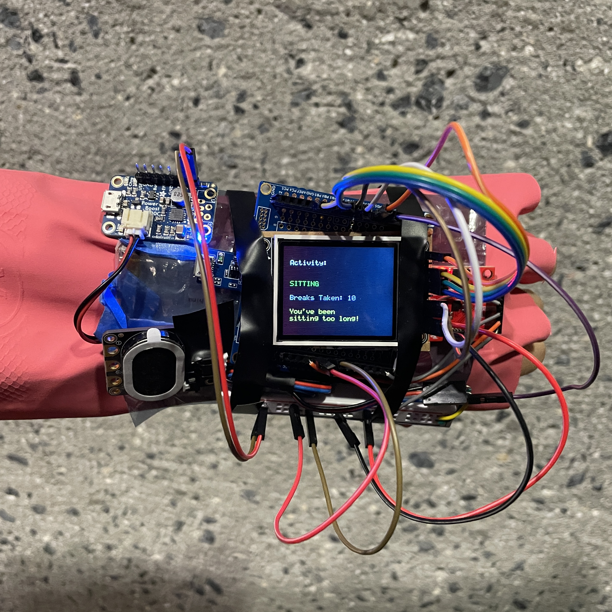
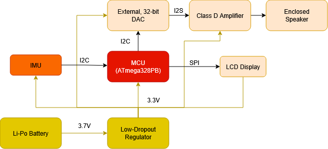
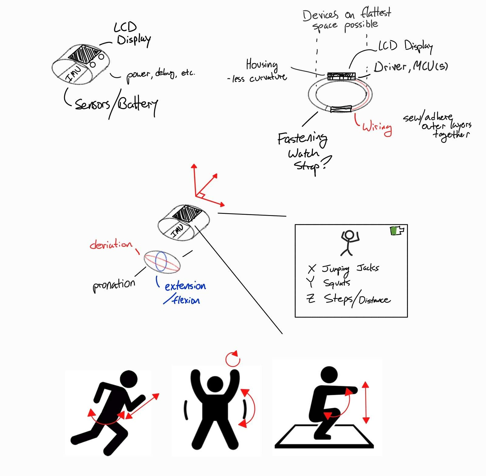
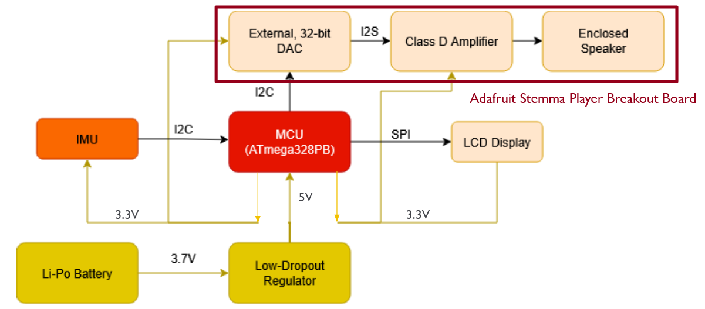

# final-project-skeleton

**Team Number:** 23

**Team Name:** CJK

| Team Member Name  | Email Address          |
| ----------------- | ---------------------- |
| Christian Durante | cgd2@seas.upenn.edu    |
| Jingyi Li         | jingyii@seas.upenn.edu |
| Kendrick Xie      | kenxie@seas.upenn.edu  |

**GitHub Repository URL:** [https://github.com/upenn-embedded/final-project-f25-f25_final_project_t23_cjk](https://github.com/upenn-embedded/final-project-f25-f25_final_project_t23_cjk)

**GitHub Pages Website URL:** [https://upenn-embedded.github.io/final-project-website-submission-f25-t23-f25-cjk/](https://upenn-embedded.github.io/final-project-website-submission-f25-t23-f25-cjk/)

# Project Description

Team CJK has developed a wearable, machine learning enabled, exercise tracking device. Our aim was to approach a novel topic to the course (Machine Learning) and ground it in an embedded, bare-metal design environment.

The resulting prototype is a fully-integrated solution that uses a single input IMU sensor to convey activity data to the user in real-time via both an LCD display and audio feedback. The decision tree inherited from an off-board training platform, converted to bare-metal C, allows for real-time performance, promising extensibility to additional activity types and more complex processing.

# Final Project Report

## 1. Video

### [Video Link](https://drive.google.com/file/d/1OWtgdUzdZQOQCd1FbEjG7ri3IBQfLfD6/view?usp=sharing)

## 2. Images


_Low resolution preview image of device_


_Device from different angle_


_Device at start of session with no sitting breaks_


_Device while running_


_Device while performing jumping jacks_


_Device at the end of session sitting after performing multiple exercises and taking multiple sitting breaks_

## 3. Results

## C Code (Microcontroller)

#### `imu_stream.c`

Data collection firmware that streams raw IMU sensor readings over serial connection.

**Purpose:** Record training data for machine learning model development

**Key functionality:**

- Initializes LSM6DSO IMU sensor via I2C at 104 Hz
- Continuously reads 6-axis data (ax, ay, az, gx, gy, gz)
- Outputs CSV-formatted data over UART serial (9600 baud)
- Provides real-time sensor data stream for Python data collection script

**Usage:** Flash this firmware when collecting new training data for activities

#### `activity_detect_withLCD&beeps.c`

Main activity detection application with real-time classification and user feedback.

**Purpose:** Real-time activity recognition with visual and audio feedback

**Key functionality:**

- **IMU Sampling:** Reads LSM6DSO sensor at 100 Hz (10ms intervals)
- **Feature Extraction:** Computes features from 1-second windows (100 samples):
  - Feature 0: Mean of accelerometer X-axis (`mean_ax`)
  - Feature 13: Standard deviation of accelerometer magnitude (`acc_mag_std`)
- **Activity Classification:** Uses decision tree model to classify activities:
  - Sitting (stationary)
  - Running (repetitive forward motion)
  - Jumping jacks (lateral arm movements)
- **LCD Display:** Shows current activity with color-coded backgrounds:
  - Sitting: Dark green background
  - Running: Dark blue background
  - Jumping jacks: Dark red background
- **Break Counter:** Tracks number of exercise-to-sitting transitions
- **Sitting Warning:** Displays "You've been sitting too long!" after 10 seconds
- **Audio Feedback:** Distinct beep patterns for each activity and transitions

**Main loop structure:**

1. Sample IMU at 100 Hz
2. Accumulate 100 samples (1 second window)
3. Extract features from window
4. Classify activity using decision tree
5. Update LCD display and trigger audio feedback
6. Reset window and repeat

#### `activity_model.c` / `activity_model.h`

Auto-generated decision tree classifier exported from Python training script.

**Purpose:** Embedded machine learning model for activity classification

**Generated by:** `export_tree_to_c.py`

**Key components:**

- **Header file (`activity_model.h`):**

  - Activity class definitions: `ACTIVITY_SITTING`, `ACTIVITY_RUNNING`, `ACTIVITY_JUMPINGJACKS`
  - Function declaration: `int predict_activity(const float features[32])`
- **Implementation (`activity_model.c`):**

  - Decision tree logic as nested if-else statements
  - Uses features[13] (acc_mag_std) and features[0] (mean_ax)
  - Returns activity class index (0=sitting, 1=running, 2=jumping jacks)

**Decision tree structure:**

```c
if (features[13] <= 4548.258301f) {  // Low movement variation
    return ACTIVITY_SITTING;
} else {
    if (features[0] <= 12306.643066f) {  // Lower mean X acceleration
        return ACTIVITY_JUMPINGJACKS;
    } else {  // Higher mean X acceleration
        return ACTIVITY_RUNNING;
    }
}
```

### Python Scripts (Training Pipeline)

#### `data_collection.py`

Collects and organizes training data from the microcontroller.

**Purpose:** Record labeled IMU data for each activity class

**Key functionality:**

- Connects to microcontroller via serial port (`/dev/cu.usbmodem1102` at 9600 baud)
- Prompts user for activity type or accepts command-line argument
- Records ~3 seconds of IMU data (300+ samples at 100 Hz)
- Saves data as CSV files in organized directory structure:

```

  activities_data/
  ├── sitting/
  │   ├── sitting_001.csv
  │   ├── sitting_002.csv
  │   └── ...
  ├── running/
  └── jumpingjacks/

```

- Auto-increments file numbers to prevent overwriting

**Usage:**

```bash
# Interactive mode
python3 data_collection.py

# Command-line mode
python3 data_collection.py sitting
python3 data_collection.py running
python3 data_collection.py jumpingjacks
```

**Output format:** CSV with columns: `ax,ay,az,gx,gy,gz`

#### `train_activity_classifier.py`

Trains decision tree classifier on collected IMU data.

**Purpose:** Build machine learning model from labeled training data

**Key functionality:**

- **Data Loading:**
  - Reads all CSV files from `activities_data/` directory
  - Organizes data by activity labels (sitting, running, jumpingjacks)
- **Feature Extraction:** Computes 32 statistical features per 100-sample window:
  - Means (6): ax, ay, az, gx, gy, gz
  - Standard deviations (6): ax, ay, az, gx, gy, gz
  - Magnitude features (4): acc_mag_mean, acc_mag_std, gyr_mag_mean, gyr_mag_std
  - Peak-to-peak amplitudes (6): all 6 axes
  - Signal magnitude area (2): accelerometer, gyroscope
  - Jerk features (2): mean and std of acceleration derivative
  - Axis correlations (6): between all axis pairs
- **Model Training:**
  - Algorithm: Decision Tree Classifier (scikit-learn)
  - Train/validation/test split: 70% / 20% / 10%
  - Hyperparameters:
    - `max_depth=5` - Limits tree complexity
    - `min_samples_leaf=1` - Minimum samples per leaf node
    - `class_weight='balanced'` - Handles class imbalance
- **Model Evaluation:**
  - Prints accuracy and classification report for train/val/test sets
  - Reports tree depth and number of leaf nodes
- **Model Persistence:**
  - Saves trained model to `activity_tree.pkl` using joblib
  - Stores model, labels, and scaler for later use

**Usage:**

```bash
python3 train_activity_classifier.py
```

**Output:**

- Console: Training metrics and model statistics
- File: `activity_tree.pkl` (serialized model)

#### `export_tree_to_c.py`

Converts trained Python decision tree to embedded C code.

**Purpose:** Export scikit-learn model for deployment on microcontroller

**Key functionality:**

- **Model Loading:**
  - Loads trained model from `activity_tree.pkl`
  - Extracts decision tree structure and parameters
- **Class Mapping:**
  - Handles sklearn's alphabetical class ordering: [jumpingjacks, running, sitting]
  - Maps to C code ordering: [sitting=0, running=1, jumpingjacks=2]
  - Generates class remapping array to ensure correct predictions
- **Code Generation:**
  - **Header file (`activity_model.h`):**
    - Activity class `#define` constants
    - Function prototype for `predict_activity()`
  - **Source file (`activity_model.c`):**
    - Decision tree as nested if-else statements
    - Feature thresholds as floating-point constants
    - Returns integer class index
- **Tree Traversal:**
  - Recursively walks sklearn tree structure
  - Converts nodes to C conditionals
  - Uses feature indices and threshold values from trained model

**Usage:**

```bash
python3 export_tree_to_c.py
```

**Output:**

- `activity_model.h` - Header with class definitions and function declaration
- `activity_model.c` - Implementation with decision tree logic
- Console output showing tree statistics and class mapping

**Example generated code:**

```c
int predict_activity(const float features[32]) {
  if (features[13] <= 4548.258301f) {  // acc_mag_std
    return 0;  // sitting
  } else {
    if (features[0] <= 12306.643066f) {  // mean_ax
      return 2;  // jumpingjacks
    } else {
      return 1;  // running
    }
  }
}
```

---

### Workflow Summary

1. **Data Collection:**
   - Flash `imu_stream.c` to microcontroller
   - Run `data_collection.py` to record training data
   - Collect 30+ samples per activity class
2. **Model Training:**
   - Run `train_activity_classifier.py` to train decision tree
   - Review accuracy metrics (target: >95% on test set)
   - Iterate on data collection if accuracy is low
3. **Model Export:**
   - Run `export_tree_to_c.py` to generate C code
   - Produces `activity_model.c` and `activity_model.h`
4. **Deployment:**
   - Include generated model files in `activity_detect_withLCD&beeps.c` project
   - Flash firmware to microcontroller
   - Real-time activity classification is now active

### 3.1 Software Requirements Specification (SRS) Results

_Based on your quantified system performance, comment on how you achieved or fell short of your expected requirements._

_Did your requirements change? If so, why? Failing to meet a requirement is acceptable; understanding the reason why is critical!_

_Validate at least two requirements, showing how you tested and your proof of work (videos, images, logic analyzer/oscilloscope captures, etc.)._

| ID     | Description                                                                                                                                                      | Validation Outcome                                                                                                                                                   |
| ------ | ---------------------------------------------------------------------------------------------------------------------------------------------------------------- | -------------------------------------------------------------------------------------------------------------------------------------------------------------------- |
| SRS-01 | The IMU 3-axis accelerometer and gyroscope shall be sampled at at least 100 Hz ±5 Hz using an I2C interrupt-based routine.                                      | Complete, shown below                                                                                                                                                |
| SRS-02 | The MCU shall process every 0.5-second window of IMU data to compute statistical and frequency features with no overlap or interference between windows.         | Partially completed, we use a window of 1.0 seconds instead to give more accurate predictions. shown below                                                           |
| SRS-03 | The embedded classifier shall correctly identify at least 3 activities (running, jumping jacks, sitting) with >85% accuracy.                                     | Completed, unconfirmed Review video, count ticks                                                                                                                     |
| SRS-04 | The current detected activity shall update on the ST7735R LCD screen within 1 second of the motion window being processed.                                       | Completed, confirmed ✅(Implicit facet of video demo.)                                                                                                               |
| SRS-05 | The software shall output at least one unique audio signal per identifiable activity type.                                                                       | Completed, confirmed ✅(Implicit facet of video demo.)                                                                                                               |
| SRS-06 | The software shall responds to at least one session-wide parameter (i.e. excessive break time) with a warning on at least one of the output `<br>`peripherals. | Completed, confirmed ✅(Implicit facet of video demo.)                                                                                                               |
| SRS-07 | The software shall allow easy addition of new activities by retraining and re-exporting the model header file.                                                   | Completed, unconfirmed as this specification is inappropriately qualitative.🧠Assess code structure to describe challenge or lack thereof of adding another activity |
| SRS-08 | The system shall operate continuously for at least 2 hours without requiring a reset or power cycle.                                                             | Completed, theoretically confirmed.`<br>`🧠(Link BOM)`<br><br>`Could technically film a timelapse lol. `<br>`                                                  |

#### Proof of SRS-01 and SRS-02

The IMU's internal Output Data Rate (ODR) is set to 104 Hz via the control registers. From `activity_detect_withLCD&beeps.c`:

```markdown
#define CTRL1_XL_104HZ 0x40 // Accelerometer ODR = 104 Hz
#define CTRL2_G_104HZ 0x40 // Gyroscope ODR = 104 Hz
```

The main loop reads IMU data with a fixed delay:

```c
while (1) {
    int16_t ax, ay, az, gx, gy, gz;
    imu_read_axes(&ax, &ay, &az, &gx, &gy, &gz);
    stats_update(&stats, ax, ay, az, gx, gy, gz);

    if (stats.count >= 100) {
        // ... prediction and processing ...
        stats_reset(&stats);
    }

    _delay_ms(10);  // This determines sampling rate
}
```

**Sampling period calculation:**

Let `delay_ms = 10` ms (from `_delay_ms(10)` at line 466)

$$
T_{\text{sample}} = 10 \text{ ms} = 0.01 \text{ s}
$$

$$
f_{sample} = \frac{1}{T_{sample}} = \frac{1}{0.01 \text{ s}} = 100 \text{ Hz}
$$

Data Collection Window

Each prediction uses a window of samples:

```c
if (stats.count >= 100) {
    float features[32];
    compute_features(&stats, features);
    int cls = predict_activity(features);
    // ...
    stats_reset(&stats);
}
```

Let `N = 100` samples (from `stats.count >= 100` at line 394)

**Time window calculation:**

$$
T_{window} = \frac{N}{f_{sample}} = \frac{100 \text{ samples}}{100 \text{ Hz}} = 1 \text{ second}
$$

Each activity classification is based on **1 second** of IMU data sampled at **100 Hz** .

$$
f_{sample} = \frac{1}{delay_ms} = \frac{1}{10 \times 10^{-3} \text{ s}} = 100 \text{ Hz}
$$

**Window duration:**

$$
T_{window} = \frac{N}{f_{sample}} = \frac{100 \text{ samples}}{100 \text{ Hz}} = 1.0 \text{ second}
$$

**Window overlap:**

Windows are non-overlapping because `stats_reset(&stats)` is called after each prediction, clearing all accumulated data before the next window begins.

### 3.2 Hardware Requirements Specification (HRS) Results

_Based on your quantified system performance, comment on how you achieved or fell short of your expected requirements._

_Did your requirements change? If so, why? Failing to meet a requirement is acceptable; understanding the reason why is critical!_

_Validate at least two requirements, showing how you tested and your proof of work (videos, images, logic analyzer/oscilloscope captures, etc.)._

| ID     | Description                                                                                                                                              | Validation Outcome                                                                                                                                                                                                                                                                                                                                                |
| ------ | -------------------------------------------------------------------------------------------------------------------------------------------------------- | ----------------------------------------------------------------------------------------------------------------------------------------------------------------------------------------------------------------------------------------------------------------------------------------------------------------------------------------------------------------- |
| HRS-01 | The system shall use two 6-axis IMUs (accelerometer + gyroscope) connected via I2C for motion data collection.                                           | Altered, new specification Successful.<br />Original specification assumed one-IMU per hand used, with using a second hand at all an open question. We employed a single IMU to attain desired performance (SRS-03).<br />Verification is existential / trivial                                                                                                  |
| HRS-02 | The LCD (ST7735R) shall communicate with the MCU via SPI and display activity text updates at least twice per second.                                    | Unsuccessful<br />Activity updates are once per second, as higher decision resolution created intermediate pauses (i.e. in-between jumping jacks) mis-registerring as Idle/Sitting<br />Quantitative assumption in HRS immaterial to performance. Underperformance here a product of improved accuracy/usability.<br />Verification shown via video demonstration |
| HRS-03 | The speaker system will produce at least one identifiable and audible (30-70dB) noise per identifiable activity type.                                    | Successful,<br />Partially Verified, demonstrated in video to be audible.                                                                                                                                                                                                                                                                                         |
| HRS-04 | The ATmega328PB Xplained Mini shall sample and process data at 100 Hz while maintaining <75% CPU utilization and maximum interrupt latency<1 ms.         | Successful<br />Firmware blocking / delay has never been observed in testing other specifications.<br />Unverified through dedicated testing/analysis.                                                                                                                                                                                                            |
| HRS-05 | The power subsystem shall provide 3.3V regulated output from a 3.7V Li-Po battery with at least 500 mAh capacity.                                        | Altered, new specification Successful.<br />Power regulator required replacement due to issues in ordering. <br />Boosts voltage to 5V to power the ATMega, and leveraging the MCU's ability to drive a 3.3 V rail for low-current peripherals.                                                                                                                   |
| HRS-06 | The total current draw of the entire system (MCU + sensors + LCD) during continuous operation shall remain ≤ 150 mA                                     | Successful<br />Verified Partially / Theoretically<br />[via BOM](https://docs.google.com/spreadsheets/d/1OW9jmg1obc5UadrgeVUhnudpmu7QJP4mielkrqyww-0/edit?usp=sharing)                                                                                                                                                                                              |
| HRS-07 | The system shall operate continuously for at least 2 hours at 35 °C without reset, crash, or data loss.                                                 | Successful,<br />Verified Partially / Theoretically<br />[via BOM](https://docs.google.com/spreadsheets/d/1OW9jmg1obc5UadrgeVUhnudpmu7QJP4mielkrqyww-0/edit?usp=sharing)                                                                                                                                                                                             |
| HRS-08 | All modules shall be mechanically integrated within an enclosure. The IMU<br />Orientation error relative to the wrist reference frame shall be ≤ 10°. | Partially successful:<br />The hardware is mechanically integrated on a single prototype, though not in an enclosure<br />This integration does, however, fulfill the need to keep the IMU in consistent orientation relative to the arm <br />(Verified via product pictures).                                                                                   |

## 4. Conclusion

Reflect on your project. Some questions to address:

- What did you learn from it?
  - Limitations of ATMega328PB: Especially with regards to audio processing and storage, the limitations of the bare-metal design context was tested more than previous, more properly scoped coursework.
  - Project Management: Turnaround on this project was uniquely short given its end-to-end development cycle within only a sub-set of the course. Orderring realities and adjusting in real time to prodcut trajectory was a new challenge.
  - Cross-over between team members
    - Some team members approached the project due to a strong ML background and conversely little hardware background
    - Team-members shared responsibilities around this but the lines often blurred, allowing for experimentation and exploration.
- What went well?
  - Device Focus and Inspiration: The team chose this device concept based on an individual's background in an advanced topic (Machine Learning). Working around this firmware proposed novel but satisfying and ultimately succesful challenges.
  - End-to-End Peripheral Integration
    - Scope of project was just within control of the ATMega XPlained Mini, but far beyond any previous course material.
    - All peripherals (IMU, Speaker, LCD) all controlled by a single firmware routine.
- What accomplishments are you proud of?
  - Performance and Firmware Integration: The prototype runs in real-time, wirelessly, with no observable errors throughout the final demonstration. While some of these may've been assumed goals based on the project domain, the device feels more cohesive and functional that the HRS/SRS alone may convey.
  - Form Factor: Although short of specification in some ways, having everything mounted on a single, lightweight wearable is visually striking and resulted in a satisfying final work period (re-training the model to more accurately account for device dimensions) and demonstration.
- What did you learn/gain from this experience?
  - Larger Codebase Management: Team Members had to review one another's code updates to remain current on device function and precisely how the MCU was being utilized.
- Did you have to change your approach?
  - Early: Putting the second E in ESE by integrating an additional peripheral (audio feedback) was a major pivot point guided by staff feedback. As seen in our demonstrations, this addition greatly boosted our confidence in our devices utility and prompted us to explore further in making the display uniquely useful in addition to the audio system.
  - Hardware Simplification: As can be seen in the evolving block diagrams, many changes were made to underlying hardware, typically simplifiying systems into fewer devices. This was an important lesso in researching the state of the art, as attempts to build the audio system from scratch was far more expensive and less effective than an off-the-shelf board from Adafruit.
- What could have been done differently?
  - Team Communication and Meeting was very sparse, resulting in submission products coming together last-minute. This reality of team members' schedules was managed but did impact the team's ability to source and respond to feedback from course staff and one another.
  - Timeline Management showed itself materially in the final rugged fidelity of the final prototype, as discussed in the following section.
- Did you encounter obstacles that you didn’t anticipate?
  - Ordering:
    - Mis-communication with Account Manager caused some planned early orders to not be placed.
    - Surprisingly, the most basic orders via Amazon did not arrive until days before the Final Demonstration
  - Hardware Integration
    - While device performance was servicable in the context of our controlled testing, and demonstration, the physical integration is the most significant deficit of the device.
    - Lead on this element, Christian, pigeon-holed on 3D-printing given the small scale and unique form factor, without accounting for other team member's changes and MEAM lab timelines.
- What could be a next step for this project?
  - Expansion: Better showcase the extensibility of the ML approach by adding addditional activities.
  - Movement Counting: Attempt to capture individual excercise repititions to carve more of a niche as a high-performance excercise aid.
  - Commercial Avenues are not of realistic interest. This project was a exploration of firmware concepts in a uniquely challenging environment at the cost of competitive utility.

## References

## C Libraries

#### From WS3 (Worksheet 3)

- **i2c.h / i2c.c** - I2C communication library for interfacing with the LSM6DSO IMU sensor over I2C protocol

#### From Lab 4

- **lib/ST7735.h / lib/ST7735.c** - Driver library for the ST7735 TFT LCD display controller, providing low-level display initialization and control functions
- **lib/LCD_GFX.h / lib/LCD_GFX.c** - Graphics library for drawing text, shapes, and managing the LCD screen with the ST7735 controller

#### Standard AVR Libraries

- **avr/io.h** - AVR device-specific I/O definitions
- **util/delay.h** - Delay functions for AVR microcontrollers
- **avr/interrupt.h** - Interrupt handling for AVR
- **stdio.h** - Standard input/output (sprintf)
- **stdint.h** - Standard integer types (int16_t, uint8_t, etc.)
- **string.h** - String manipulation (memset)
- **math.h** - Mathematical functions (sqrtf)

### Python Libraries

#### data_collection.py

- **serial** - PySerial library for serial communication with the microcontroller over USB
  - Used to read IMU data from the device
  - Install: `pip install pyserial`
- **time** - Standard library for time-related functions
- **os** - Standard library for file and directory operations
- **glob** - Standard library for file pattern matching
- **sys** - Standard library for command-line argument handling

#### train_activity_classifier.py

- **numpy** - Numerical computing library for array operations and mathematical functions
  - Install: `pip install numpy`
- **pandas** - Data manipulation library for reading and processing CSV files
  - Install: `pip install pandas`
- **scikit-learn** - Machine learning library
  - **sklearn.tree.DecisionTreeClassifier** - Decision tree classifier
  - **sklearn.utils.shuffle** - Dataset shuffling utility
  - **sklearn.metrics** - Model evaluation metrics (accuracy_score, classification_report)
  - Install: `pip install scikit-learn`
- **joblib** - Library for saving and loading Python objects (model persistence)
  - Install: `pip install joblib`
- **os** - Standard library for file operations
- **glob** - Standard library for file pattern matching

#### export_tree_to_c.py

- **joblib** - Library for loading saved model files
  - Install: `pip install joblib`
- **numpy** - Used for array operations when processing model data
  - Install: `pip install numpy`

# Final Project Proposal

## 1. Abstract

This project aims to design a wearable activity recognition system that detects and displays several distinct human movements such as running, jumping jacks, and sitting. Using data from IMU sensors mounted on the wrists, the system processes motion data in real time on an ATmega328PB Xplained Mini board and classifies the activity through a lightweight embedded model. Individual repetition tracking and overall session progress will both be communicated through an LCD screen as well as a speaker.

## 2. Motivation

Team CJK aims to create an energy-efficient, low-cost platform that recognizes basic human activities locally without needing a smartphone or cloud connection. This system will demonstrate how machine learning concepts can be applied in constrained embedded environments for health tracking, rehab monitoring, or gesture-based interfaces.

Many wearable fitness devices rely on large, pre-trained models or external cloud processing. This project explores an embedded, bare-metal approach to motion classification that runs entirely on a low-power microcontroller.

This problem was chosen to explore a specialized topic (Machine Learning) in the context of the courses established hardware tools. While this goal is drawn from a team member’s specific background, the team’s shared goal of creating a wearable device imposes a set of novel hardware challenges on top of what is otherwise a software-driven motivation. To this end, an additional audio feedback system integrates several hardware modules to provide additional feedback and ease of use.

## 3. System Block Diagram



## 4. Design Sketches

Little special manufacturing is required beyond soldering and 3D printing a simple enclosure for comfort and sensor stability. Some sewing or adhering may be needed to keep wiring protected between outer layers of the device.



## 5. Software Requirements Specification (SRS)

_Formulate key software requirements here. Think deeply on the design: What must your device do? How will you measure this during validation testing? Create 4 to 8 critical system requirements._

_These must be testable! See the Final Project Manual Appendix for details. Refer to the table below; replace these examples with your own._

### **5.1 Definitions, Abbreviations**

- IMU – Inertial Measurement Unit (accelerometer + gyroscope)
- LCD – Liquid Crystal Display (ST7735R)
- ISR – Interrupt Service Routine
- Classifier/Software – Embedded decision tree classifier running on MCU

### **5.2 Functionality**

| ID     | Description                                                                                                                                              |
| ------ | -------------------------------------------------------------------------------------------------------------------------------------------------------- |
| SRS-01 | The IMU 3-axis accelerometer and gyroscope shall be sampled at at least 100 Hz ±5 Hz using an I2C interrupt-based routine.                              |
| SRS-02 | The MCU shall process every 0.5-second window of IMU data to compute statistical and frequency features with no overlap or interference between windows  |
| SRS-03 | The embedded classifier shall correctly identify at least 3 activities (running, jumping jacks, sitting) with >85% accuracy.                             |
| SRS-04 | The current detected activity shall update on the ST7735R LCD screen within 1 second of the motion window being processed.                               |
| SRS-05 | The software shall output at least one unique audio signal per identifiable activity type.                                                               |
| SRS-06 | The software shall responds to at least one session-wide parameter (i.e. excessive break time) with a warning on at least one of the output peripherals. |
| SRS-07 | The software shall allow easy addition of new activities by retraining and re-exporting the model header file.                                           |
| SRS-08 | The system shall operate continuously for at least 2 hours without requiring a reset or power cycle.                                                     |

## 6. Hardware Requirements Specification (HRS)

_Formulate key hardware requirements here. Think deeply on the design: What must your device do? How will you measure this during validation testing? Create 4 to 8 critical system requirements._

_These must be testable! See the Final Project Manual Appendix for details. Refer to the table below; replace these examples with your own._

### **6.1 Definitions, Abbreviations**

- I2C – Inter-Integrated Circuit communication bus
- SPI – Serial Peripheral Interface
- LDO – Low Dropout Voltage Regulator
- IMU – Inertial Measurement Unit

### **6.2 Functionality**

| ID     | Description                                                                                                                                         |
| ------ | --------------------------------------------------------------------------------------------------------------------------------------------------- |
| HRS-01 | The system shall use two 6-axis IMUs (accelerometer + gyroscope) connected via I2C for motion data collection.                                      |
| HRS-02 | The LCD (ST7735R) shall communicate with the MCU via SPI and display activity text updates at least twice per second.                               |
| HRS-03 | The speaker system will produce at least one identifiable and audible (30-70dB) noise per identifiable activity type.                               |
| HRS-04 | The ATmega328PB Xplained Mini shall sample and process data at 100 Hz while maintaining <75% CPU utilization and maximum interrupt latency<1 ms.    |
| HRS-05 | The power subsystem shall provide 3.3V regulated output from a 3.7V Li-Po battery with at least 500 mAh capacity.                                   |
| HRS-06 | The total current draw of the entire system (MCU + sensors + LCD) during continuous operation shall remain ≤ 150 mA                                |
| HRS-07 | The system shall operate continuously for at least 2 hours at 35 °C without reset, crash, or data loss.                                            |
| HRS-08 | All modules shall be mechanically integrated within an enclosure. The IMU orientation error relative to the wrist reference frame shall be ≤ 10°. |

## 7. Bill of Materials (BOM)

_[ONGOING SHEET HERE](https://docs.google.com/spreadsheets/d/1OW9jmg1obc5UadrgeVUhnudpmu7QJP4mielkrqyww-0/edit?usp=sharing)_

Initial List:

| Component                                | Description                        | Reason for Use                                                                                                                                               |
| ---------------------------------------- | ---------------------------------- | ------------------------------------------------------------------------------------------------------------------------------------------------------------ |
| ATmega328PB Xplained Mini                | Main MCU and development board     | Core processing and interfacing platform                                                                                                                     |
| 2×IMU Sensor (e.g., MPU6050 or LSM6DSO) | 6-axis motion sensing              | Detect acceleration and rotation                                                                                                                             |
| ST7735R 1.8” LCD                        | Display, controlled via SPI        | Show recognized activity text/icon in real time.``Familiarity, can build upon graphical library from Lab4: Pong                                              |
| Li-Po Battery (3.7V 500mAh)              | Power supply                       | Portable operation                                                                                                                                           |
| LDO Regulator (3.3V)                     | Power conversion                   | Stable voltage for MCU + sensors                                                                                                                             |
| Class-D Audio Amplifier                  | Signal treatment for speaker       | All speakers of interest operate at prohibitively high wattage for ATMega to drive directly.                                                                 |
| External DAC                             | Convert MCU output to audio format | Higher audio quality than attainable with 10-bit DAC on ATMega                                                                                               |
| Speaker                                  | Secondary output                   | Additional feedback for user that interferes less with operation (a workout)                                                                                 |
| (Optional) 3D-printed case               | Mechanical support                 | Mounting and protection                                                                                                                                      |
| (Optional) Feather ESP32 Wi-Fi Module   | Wireless Communication             | Potential extension of project: real-time training (purely data transfer similar to controller example).Wireless communication between wrist sensor modules. |

## 8. Final Demo Goals

More details under Sprint Planning

On demo day, the prototype will:

- Be worn or held by a person performing **running, jumping jacks, and sitting.**

  - Library of movements subject to change as scope of 1 or 2 IMU modules is an open question at time of Proposal
- Provide Feedback:

  - Display the detected activity name (e.g., “RUNNING”, “SITTING”) on the ST7735R LCD in real time.
  - Play an audio signal between each movement repitiion, as well as addition, session-wide warnings or messages.
- Show smooth transitions between activities with stable recognition.
- Optionally, demonstrate the ability to add new activities (e.g., walking, standing) by uploading a retrained model.

## 9. Sprint Planning

_You've got limited time to get this project done! How will you plan your sprint milestones? How will you distribute the work within your team? Review the schedule in the final project manual for exact dates._

| Milestone  | Functionality Achieved                                                                                                                                                                                                                                                                                                                                                                                                                                                                                                                                                                      | Distribution of Work                                                                                                                                                                                                           |
| ---------- | ------------------------------------------------------------------------------------------------------------------------------------------------------------------------------------------------------------------------------------------------------------------------------------------------------------------------------------------------------------------------------------------------------------------------------------------------------------------------------------------------------------------------------------------------------------------------------------------- | ------------------------------------------------------------------------------------------------------------------------------------------------------------------------------------------------------------------------------ |
| Sprint #1  | Software:<br />Be able to read IMU data in some form<br />Externally Train ML model, early conversion to C<br /><br />Hardware:<br />Power - still connected to XPlained/Computer<br />Screen Operational<br />Inventory Purchased Items, take action on any remaining purchases<br />Drive Speakers                                                                                                                                                                                                                                                                                        | Kendrick has expressed a goal to focus on software.                                                                                                                                                                            |
| Sprint #2  | Software:<br />Accurately recognize and count at least 1 gesture.<br />Create low-fidelity audio messages<br /><br />Hardware:<br />All MCUs and modules operational on one testing model (even if not wearable)<br />Verify battery power operation, most debugging and testing still done on breadboard<br />Bare minimum mounting - use purchased components to be able to wear a testing setup.                                                                                                                                                                                         | Kendrick has expressed a goal to focus on software.<br /><br />Screen iteration and python/C interfacing are likely a unique role from enclosure/wearable design (moving beyond breadboarding to decrease hardware footprint). |
| MVP Demo   | Software:<br />Accurately recognize and count at least 2 gestures<br />Maintain audio library to scale with recognizable gestures<br /><br />Hardware:<br />Screen - show IMU data in real time for debugging.<br />Safely wearable, some bulkier components like boards/screen exposed / slightly inhibiting movement.<br />Fully operational without external power (computer, lab bench)                                                                                                                                                                                                 | Ditto Above                                                                                                                                                                                                                    |
| Final Demo | Software<br />Accurately demonstrate at least 3 gestures<br />Debug Mode: show underlying IMU data, to better convey “moment of recognition” to verify processes of model.<br />Audio signals for each movement type are relayed in real time.<br /><br />Hardware<br />Comfortably Wearable: All major components contained throughout uncautious movement (teaching staff or other non-team personnel testing)<br />Demonstrate/Test full battery life cycling<br />Discuss/justify hardware sizing.<br /><br />Review<br />Fully justify the decision to use 2nd wrist sensors or not. | All team members should be able to discuss/justify the basic operation and choices of software used.                                                                                                                           |

**This is the end of the Project Proposal section. The remaining sections will be filled out based on the milestone schedule.**

# Sprint Review #1

## Last week's progress

Sorted by functionality

- Implemented **IMU data logging** on the ATmega328PB

  - Reads accelerometer and gyroscope values from the LSM6DSO over I2C
  - Streams raw IMU measurements over UART at 9600 baud in clean CSV-like format
  - Verified stable and continuous data capture on the serial monitor
- Developed **Python-based data collection pipeline**

  - Script captures 10-second IMU sessions directly from serial
  - Automatically organizes data into folders by activity type
  - Produces consistent training data for machine learning
- Built an **initial activity classification model**

  - Extracts mean and standard deviation features from each IMU axis
  - Trains a lightweight Decision Tree classifier
  - Uses a 70/20/10 train/validation/test split
  - Demonstrates accurate separation of “sitting” vs “moving” activities
- Implemented **real-time Python activity detection**

  - Streams IMU data from serial
  - Uses a sliding 1-second window and same feature extraction as training
  - Continuously prints predicted activity in real time
- Ported **LCD Display Code**

  - Simplified Lab 4 code base to verify ability to drive LCD display
  - In the process, somehow damaged ATMega functionality
    - Progressed impaired by need to replace and re-solder another ATMega
  - Did not get to merge with Kendrick's IMU-reading scripts, code bases are pretty disogranized/seperated currently
- **Researched Audio Peripherals** - Connections and challenges for connecting audio peripherals

  - **Parts have not arrived**, so preparing ahead of time to expedite development when they arrive.
  - Identified repeated use of I2C, requiring use of select pins, etc. that previous labs have not quite required
  - Detailed in Research Document (linked as part of current state)

## Current state of project

#### (Embedded C – ATmega328PB)

- Initializes UART and I2C
- Configures the LSM6DSO IMU to stream accel/gyro data at 104 Hz
- Reads raw sensor values every 10 ms
- Outputs formatted IMU readings:`t_ms, ax, ay, az, gx, gy, gz`
- Serves as the primary data source for both training and live inference

#### `data_collection.py`

- Connects to the board over serial (`/dev/cu.usbmodem102`)
- Records **10-second data windows**
- Stores CSVs under: activities_data/`<activity>`/`<activity>`\_N.csv
- Used to collect labeled datasets such as **sitting** and **moving**

#### `train_activity_classifier.py`

- Loads CSVs for all activities
- Extracts summary features:
- mean(ax…gz)
- std(ax…gz)
- Performs a **70/20/10** train/validation/test split
- Trains a `DecisionTreeClassifier(max_depth=3)`
- Saves model as `activity_tree.pkl`

#### `realtime_activity_detector.py`

- Opens the IMU serial data stream
- Buffers a **100-sample (~1s)** sliding window
- Computes the same features used for training
- Loads the trained Decision Tree model
- Prints predicted activity every second, for example:
  - [PREDICTION] Activity: sitting
  - [PREDICTION] Activity: moving

### [Research Document/Reference for other systems - Audio, Wiring, etc.](https://docs.google.com/document/d/1seXDK-L8XS4Tszn1cjaAHLBiy65XiSOiNmsid0RwNuU/edit?usp=sharing)

### Demo Video

**Real-Time Activity Classification Demo**

[](https://youtu.be/3w5N1JwcPCc)

### Specific Task Definitions

- Be able to read IMU data in some form
  - AHEAD, see next
- Externally Train ML model, early conversion to C
  - COMPLETE
  - essentially the "stretch" goal of the first, pipeline to python testing and early ML model implemented
- Screen Operational
  - COMPLETE
- Drive Speakers
  - AS COMPLETE AS POSSIBLE
  - Part has yet to arrive, performed some preliminary research.

## Next Week's Plan

Addressing each point from the Proposal's plan for the week, identifying where we are ahead, behind

- Accurately recognize and count at least 1 gesture.

  - ON SCHEDULE
  - We have the pipeline of IMU data - python training established
  - Purely by the language of the requirement, we are determining one non-stationary state already, but clearly we can:
    - Have this functionality on-board
    - Convey it using our other periperhals
- Create low-fidelity audio messages

  - ON SCHEDULE\* (we correctly predicted this having the largest ordering pipeline, so "actually drive the speaker" for week 2 if on schedule for now.)
  - Some risk this still stays in the realm of pseudocode
- All MCUs and modules operational on one testing model (even if not wearable)

  - AHEAD OF SCHEDULE: Simply need to route IMU data to Display as well as Python training.
- Verify battery power operation, most debugging and testing still done on breadboard

  - ON SCHEDULE - again, another "bare minimum" funcitonality for something that hasn't arrived yet appears like a major goal for week 2
- Bare minimum mounting - use purchased components to be able to wear a testing setup.

  - ON SCHEDULE - all on-hand peripherals funcitoning, low-fidelity glove arriving is all we need.
  - Even less risk of ordering slowing this task past week 2 since Amazon can all but guarantee timely shipping.
- Assess participation

  - This is mentioned here more to keep a paper trail rather than to attribute any blame / issue.
  - A team member has communicated a family matter that has prevented them from contributing, even to the point of keeping them out of town.
  - If this continues to be the case, teaching staff may need to step in to ensure the best outcome for the project/team.
    - The extent of time this has prevented full participation is concerning.

# Sprint Review #2

## Last week's progress

### Hardware

- **Full Pipeline Integration**
  - Previously: IMU data recieved on ATMega, then to Python terminal for activity recognition and IMU debugging
  - Added full LCD functionality - can now show recognized activity
  - Trained ML model now loaded directly onto ATMega.

### Firmware/Software:

- **Completed end-to-end on-device machine-learning deployment pipeline**

  - Built `export_tree_to_c.py`, which converts a trained Python decision tree into pure C code.
  - Automatically generates two files:

    - `activity_model.h` declares the C inference function and class indices.
    - `activity_model.c` contains the fully inlined decision-tree logic.
- **Created `activity_detect.c`**

  - Reads IMU data continuously
  - Maintains a rolling **100-sample (~1 sec)** window and computes:
    - mean(ax, ay, az, gx, gy, gz)
    - std(ax, ay, az, gx, gy, gz)
  - Passes the 12-element feature vector into `predict_activity()`.
  - Prints inferred activity (`Activity: sitting` / `Activity: moving`)
- **Integrated Embedded ML**

  - Activity detection runs in real time on the ATmega328PB.
  - Outputs updated prediction once per second.

## Current State of Project

### Hardware

- Full Pipeline Integration\* Previously: IMU data recieved on ATMega, then to Python terminal for activity recognition and IMU debugging
- - Added full LCD functionality - can now show recognized activity
- \*Full Pipeline Integration
  - Previously: IMU data recieved on ATMega, then to Python terminal for activity recognition and IMU debugging
  - Added full LCD functionality - can now show recognized activity
- Identified gaps in original orderred materials
  - LiPo Battery and LDO regulator not ordered from original BOM
  - Low-Fidelity glove still has not arrived
- Power Management
  - Confirmed I-V requirements to re-affirm choice to use LiPo cell
    - [Research Here](https://docs.google.com/spreadsheets/d/1OW9jmg1obc5UadrgeVUhnudpmu7QJP4mielkrqyww-0/edit?usp=sharing)
  - Borrowed cell and charger from Detkin
  - Still need regulator: re-determined total current draw to best choose a power management solution.
  - Ordering to be completed this weekend.

### Firmware

(Embedded C – ATmega328PB)

- Fully integrated real-time IMU sampling + feature extraction + ML inference.
- UART output now includes activity classification at 1 Hz

`activity_model.c` and `activity_model.h`

- Tiny ML inference engine generated automatically from the Python model.
- `activity_model.h` defines:
  - Class label macros (`ACTIVITY_SITTING`, `ACTIVITY_MOVING`)
  - Function prototype:
    `int predict_activity(const float features[12]);`
- `activity_model.c` contains:
  - A compact C implementation of the decision tree

`activity_detect.c` (Embedded Inference Runtime / Updated main.c)

- 100% on-device activity detection.
- Performs:
  - IMU initialization (I2C)
  - Raw sensor reads (104 Hz accel/gyro)
  - Sliding-window feature computation
  - Calls into the exported ML model (`predict_activity()`)
- Prints human-readable results over UART.

### Software

`export_tree_to_c.py`

- Loads the trained Python Decision Tree (`activity_tree.pkl`)
- Translates its internal structure into pure C (`if` / `else`) with no heap or dynamic allocation.
- Outputs:
  - `activity_model.h` class macros + prototype
  - `activity_model.c` the decision logic itself
- Guarantees reproducible deployment of ML models on constrained microcontrollers.

## Demo Video

**Real-Time Activity Classification (only C) Demo**

[](https://youtu.be/FV6rmzVz4TA)

### Reviewing Sprint Goals

- Accurately recognize and count at least 1 gesture.
  - COMPLETE
  - Performance slightly degraded when porting to C, could be further ahead.
- Create low-fidelity audio messages
  - IN-PROGRESS
  - Successfully driving speaker.
- All MCUs and modules operational on one testing model (even if not wearable)
  - COMPLETE
- Verify battery power operation, most debugging and testing still done on breadboard
  - INCOMPLETE due to previously missed orderring issue.
  - Performed further research on power needs, sourced Detkin resources in the meantime.
- Bare minimum mounting - use purchased components to be able to wear a testing setup.
  - UNABLE TO COMPLETE, due to part shipping
  - Willing to pay minimal cost out-of-pocket to ensure we have at least some kind of glove for MVP demo.

## Next Week's Plan

Scoping to stated MVP demo goals:

- Accurately recognize and count at least 2 gestures
  - ON SCHEDULE currently tracking 2 main states.
  - Now able to export trained features to C so extending performance should be considerably easier now
- Maintain audio library to scale with recognizable gestures
  - BEHIND SCHEDULE with parts recently arrived, requires the most new code to interface with this peripheral.
  - Should be a well-explored problem.
- Screen - show IMU data in real time for debugging.
  - COMPLETE
- Safely wearable, some bulkier components like boards/screen exposed / slightly inhibiting movement.
  - BEHIND SCHEDULE due to missing component
  - Looking to mount everything
- Fully operational without external power (computer, lab bench)
  - BEHIND SCHEDULE due to ordering.

Improve meeting frequency

- Previously have not been meeting regularly enough / holding accountability
- Given shorter turn-around time until MVP demo, team is aiming to meet more.

# MVP Demo

## [Slide Deck answers questions in order as well](https://docs.google.com/presentation/d/1GhEzTn4sMKmN0XCGV2NyqFW66TKdCjyA6N7Onp5WxGs/edit?usp=sharing)

## 1. Show a system block diagram & explain the hardware implementation.



- At a Glance
  - [BOM can inform specific part choices](https://docs.google.com/spreadsheets/d/1OW9jmg1obc5UadrgeVUhnudpmu7QJP4mielkrqyww-0/edit?usp=sharing), including added research section
- Changes from initial design
  - All audio components integrated far more compactly than we could manufacture via Adafuirt Stemma Audio Board
  - Power routed from battery regulator to ATMega, then distributed using the ATMega's connections, rather than some seperate board or rail powering the peripherals.

## 2. Explain your firmware implementation, including application logic and critical drivers you've written.

- Python-Side (Pre-training)

  1. `data_collection.py:`

     - Creates .csv files of raw IMU data points for decision tree creation
  2. `train_activity_classifier.py`

     - Loads CSVs for all activities, extracts summary features:
       - mean(ax…gz)
       - std(ax…gz)
     - Trains a `DecisionTreeClassifier(max_depth=3)`
     - Saves model as `activity_tree.pkl`
  3. `export_tree_to_c.py`

     - Uses activity_tree.pkl to:
     - Export a class prototype via activity_model.h
     - Export the trained decision logic via activity_model.c
- Bare-Metal C

  1. `activity_detector_withLCD.c`

     - Initializes hardware peripherals (Speaker, LCD screen) using seperate headers
     - Uses exported decision tree to drive those peripherals in real-time.
  2. `speaker_only.c`

     - Initializes ATMega328 connections, timers for speaker operation.
     - processes x_audio.h, generated encodings of voice-like audio for improved user feedback
  3. `i2c.h`

     - inherited library from Penn Embedded library of examples
  4. `LCD_GFX, ST7735 .c and .h`

     - inherited library from 5190's Lab 4

## 3. Demo your device.

[UART Demo - Other periperhals left out for improved accuracy of activity tracking at current stage](https://drive.google.com/file/d/1FzCMxN5Cbjt-W_gwL2gBXSlLgY2HHvF2/view?usp=sharing)

## 4. Have you achieved some or all of your Software Requirements Specification (SRS)?

Original SRS Definitions omitted for readability, linked via gradescope page assignment:

Show how you collected data and the outcomes.

| Spec.  | Shorthand Definition                                                   | Progress and Rationale                                                                                                                                                                                                                                                                                  |
| ------ | ---------------------------------------------------------------------- | ------------------------------------------------------------------------------------------------------------------------------------------------------------------------------------------------------------------------------------------------------------------------------------------------------- |
| SRS-01 | I2C Serial Communicationto capture ideal IMU performance               | ACHIEVED<br />- defined in code, I2C interrupts occur at prescaling of ATMega Clock (far faster than 100Hz)<br />- likely to be reigned in to improve power performance                                                                                                                                 |
| SRS-02 | Data is preprocessed to keepactivities separable and observable        | ACHIEVED, verification to be improved<br />- Tick Rate in UART demonstration is 0.5 Hz, properly removes noise ("sitting" being detected at inflection points of movement)<br />- True numeric accuracy would be useful, currently this is essentially just a code definition rather than a true metric |
| SRS-03 | Accurately Identify 3 Activities                                       | ACHIEVED, verification to be improved<br />- Demonstration Video qualitatively shows 3 activities<br />- Statistical Analysis to be completed, especially as training is improved to allow for user-testing.                                                                                            |
| SRS-04 | Continuously update LCD Screen                                         | ACHIEVED<br />- [Video Proof](https://drive.google.com/file/d/1OXmcDV1blYmeGAkA6iuMW3uh_cYR6e3f/view?usp=sharing)<br />- Quantitative verification (exact refresh rate) defined in code                                                                                                                    |
| SRS-05 | Unique Audio Signals per identifiable activity type.                   | ACHIEVED, though related HRS is not<br />- Shown at demo with account manager<br />- speaker-only.c produces audio properly<br />- `jumping_audio.h`<br />- `running_audio.h`<br />- `sitting_audio.h`                                                                                            |
| SRS-06 | Session-Wide Paramter (Additional timer and sounds to control workout) | NOT ACHIEVED<br />- Deemed a low-priority, less critical function<br />- All underlying pieces (ATMega Timer Control, Printing Strings to Screen) in place, driver currently unwritten.                                                                                                                 |
| SRS-07 | Extensibility: can add additional activities                          | ACHIEVED<br />- Activities have increased between each sprint and the MVP demo<br />- No qualitative measure to falsify this SRS                                                                                                                                                                        |
| SRS-08 | Stability: No Time-Out throughout battery life                         | ACHIEVED<br />- Demonstrations and videos<br />- Functionality is continuous so long as the device is powerred, in line with coding practices from course labs                                                                                                                                          |

## 5. Have you achieved some or all of your Hardware Requirements Specification (HRS)?

Original HRS Definitions omitted for readability, linked via gradescope page assignment:

Show how you collected data and the outcomes.

| Spec.  | Definition                                              | Progress and Rationale                                                                                                                                                                                                                                                                                                                                                                               |
| ------ | ------------------------------------------------------- | ---------------------------------------------------------------------------------------------------------------------------------------------------------------------------------------------------------------------------------------------------------------------------------------------------------------------------------------------------------------------------------------------------- |
| HRS-01 | IMU Dimensionality                                      | ACHIEVED, some deviation from original definition<br />- "The system shall use two 6-axis IMUs" was written before approval while the decision to use one or both hands was open<br />- This definition implies one IMU per-hand, which is the case currently<br />- [Dimensionality a core feature of part choice](https://www.sparkfun.com/sparkfun-6-degrees-of-freedom-breakout-lsm6dso-qwiic.html) |
| HRS-02 | Using LCD + Driver, updating in real time               | ACHIEVED<br />- [Video Proof](https://drive.google.com/file/d/1OXmcDV1blYmeGAkA6iuMW3uh_cYR6e3f/view?usp=sharing)                                                                                                                                                                                                                                                                                      |
| HRS-03 | Speaker Produces Identifiable and Audible Audio Signals | NOT ACHIEVED<br />- Currently our audio system has a storage bottleneck<br />- Only a single encoded audio file can be loaded properly<br />- These files have been written and individually function (SRS-05), but physically outputting them through our hardware is an open problem                                                                                                               |
| HRS-04 | No Over-Utilization of ATMega328                        | ACHIEVED<br />- Various video demonstrations above<br />- Essentially, ATMega stability preserved, no brown-outs or memory issues in current working models (HRS-03 at times breaking this)                                                                                                                                                                                                          |
| HRS-05 | Power Regulation + Capacity                             | ACHIEVED<br />- [Second Page of BOM](https://docs.google.com/spreadsheets/d/1OW9jmg1obc5UadrgeVUhnudpmu7QJP4mielkrqyww-0/edit?usp=sharing), research done to derive worst-case current draw and relation to battery operation                                                                                                                                                                           |
| HRS-06 | Peak Total Current Draw                                 | ACHIEVED<br />- See HRS-05                                                                                                                                                                                                                                                                                                                                                                           |
| HRS-07 | Battery Life > 2hrs                                     | ACHIEVED, verifcation requires improvement<br />- See HRS-05<br />- Battery life has not physically tested for full duration, and full model integration is an open question                                                                                                                                                                                                                         |
| HRS-08 | Enclosure, IMU angle error                              | PARTIALLY ACHIEVED<br />- IMU Angle Error not physically measured but video proofs above show consistency and seperability due to consistent IMU positioning<br />- Full enclosure, at this stage, more of a "remaining element" than a core functionality                                                                                                                                           |

## 6. Show off the remaining elements that will make your project whole: mechanical casework, supporting graphical user interface (GUI), web portal, etc.

- That same [Second Page of BOM](https://docs.google.com/spreadsheets/d/1OW9jmg1obc5UadrgeVUhnudpmu7QJP4mielkrqyww-0/edit?usp=sharing) also has collections of peripheral footprints
  - Team will create a 3D-printed case, time-permitting
- GUI technically present in LCD operation, though it isn't particuarly interactive outside of user motions.

## 7. What is the riskiest part remaining of your project?

- Hardware Security / Fidelity
  - Have been having issues from disconnected sensors, often requiring power cycling
- Overall Integration / Wearability
  - Currently showing real-time, high performance activity detection seperately from peripheral functionality due to bulky integrations
  - Will be remedied at least partially by creating a case/enclosure.

## 8. What questions or help do you need from the teaching team?

- What other resources exist for sourcing parts last-minute?

  - Team acknowledges this may require paying out-of-pocket (ideallly able to file for reimbursement after the fact out of project fund)
  - Required Parts:
    - Storage - audio system currently bottle-necked by ability to host realistic-sounding audio directly on the ATMEGA
    - Gloves / Wearable component - less of an issue to source, unusual shipping delays from Amazon has kept team without a model to secure peripherals to.
